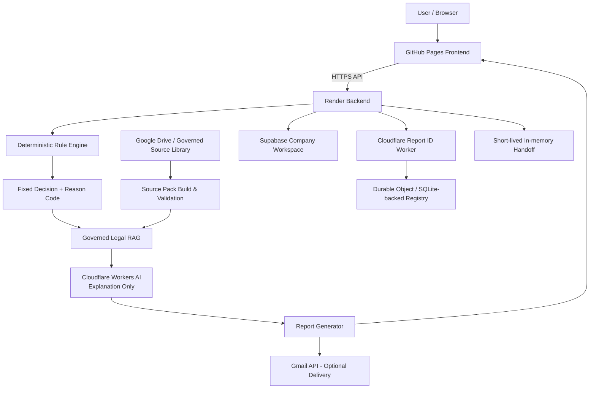

# GrowWithHR — Architecture, Data Journey, Security, Governance & Enterprise Hardening Handbook

**Prepared:** 20 August 2026  
**Repository:** `hrtechifyed/GrowwithHR-Version2`  
**Architecture baseline:** current `main` as reviewed on 20 August 2026; the core architecture is materially consistent with the 19 August 2026 architecture assessment, with the current `HOW_GROWWITHHR_WORKS.md` added on top.  
**Classification:** Internal architecture, security, privacy and governance working document  
**Core design principle:** **Rules decide. Governed sources substantiate. Artificial intelligence explains.**

> This is an architecture and governance description, not legal advice, a penetration-test report, a SOC 2 report, an ISO 27001 certification, a DPDP certification, or a warranty that the system cannot be breached. Where legal obligations are discussed, qualified legal counsel should confirm the interpretation for the actual customer relationship and processing context.

---

## 0. Executive summary

GrowWithHR is a structured people and compliance intelligence platform. Its most important architectural choice is to separate **decision authority**, **evidence retrieval**, **language generation**, and **data persistence**.

The intended compliance flow is:

```text
Structured company facts
        ↓
Deterministic Rule Engine
        ↓
Fixed outcome / reason / missing-fact state
        ↓
Governed, source-scoped RAG
        ↓
Cloudflare Workers AI explanation only
        ↓
Report / PDF / optional Gmail delivery
```

Artificial intelligence is therefore not intended to decide which law applies, fill in missing company facts, choose jurisdiction, change a deterministic status, or certify compliance. The legal RAG layer operates **after** a fixed rule decision and is restricted to governed source material allowed by the relevant rule/profile.

The reusable **Company Workspace** is stored in Supabase. The large reusable Company Data payload is encrypted by the Render backend using **AES-256-GCM before storage**. The Workspace Recovery Code is not stored in plaintext; a **SHA-256 hash** is stored and verified using a timing-safe comparison. The privileged Supabase service credential remains backend-only.

The architecture nevertheless has material hardening gaps. The highest-priority ones are:

1. browser `localStorage` can contain user assessment/progress/contact/report data as ordinary JSON;
2. recovery and other sensitive APIs need explicit rate limiting and abuse controls;
3. the dedicated workspace encryption secret should be mandatory, versioned and rotatable;
4. unnecessary `anon`/`authenticated` database privileges should be revoked in addition to RLS;
5. the current Supabase production project is in **Seoul (`ap-northeast-2`)**, not India;
6. the connected Supabase project also contains at least one unrelated HRTechify workload table, so enterprise production should use a dedicated GrowWithHR project/database boundary;
7. Gmail-delivered reports create retained copies outside the Company Workspace deletion lifecycle;
8. the current identity model is Recovery Code based rather than enterprise IAM/SSO/RBAC;
9. retention scheduling relies partly on an in-process Render scheduler and should have a durable external scheduler with observable run history;
10. enterprise assurance still requires formal SDLC, audit logging, monitoring, incident response, penetration testing, vendor governance, BCDR, DPIA and—if commercially needed—independent SOC 2/ISO 27001 readiness.

The correct current positioning is therefore:

> **Research-grade, deliberately governed and privacy-conscious, with meaningful technical controls, but not yet independently assured enterprise security.**

---

# 1. System scope and non-goals

## 1.1 What GrowWithHR is

GrowWithHR is designed to process structured organisation-level information and generate people/compliance intelligence. The current architecture supports compliance intelligence and organisation-structure intelligence, with a broader modular direction over time.

Typical organisation-level facts can include:

- company/legal-entity information;
- industry and nature of business;
- employee/worker/contractor counts;
- operating states and locations;
- work model;
- manufacturing/activity information;
- growth information;
- selected priorities;
- contact name and email;
- structured facts required by specific intelligence modules.

## 1.2 What it is not intended to be today

The current product should not be used as a repository for sensitive employee case-management material such as:

- medical records;
- payroll-level individual records;
- disciplinary case files;
- grievance or complaint evidence;
- investigation evidence;
- detailed employee performance cases;
- individual health or disability information;
- unnecessary identity documents;
- person-level coercion/trafficking/violence narratives;
- other high-risk employee-level personal data unless a future module is expressly designed and governed for that purpose.

It is also not intended to provide:

- certified legal advice;
- proof of statutory compliance;
- an AI-generated legal determination;
- immigration/tax/cross-border employment determinations under the current legal RAG release;
- unrestricted live-document search over arbitrary Google Drive files.

---

# 2. High-level architecture



Plain-English responsibilities:

| Component | Role | Does not own |
|---|---|---|
| GitHub repository | Source code, deterministic rules, schemas, tests, governance artefacts | Live customer workspace storage |
| GitHub Pages | Public frontend/static application | Privileged secrets or database service role |
| Browser | User interaction and temporary continuity | Trusted long-term secure storage |
| Render | Private API boundary, orchestration, encryption/decryption, email, provider calls | Source-of-truth legal authority |
| Rule Engine | Deterministic product decision | Natural-language generation |
| Supabase | Reusable Company Workspace database | Rule correctness or app encryption design |
| Governed RAG | Retrieves allowed source chunks after decision | Applicability decision or fact creation |
| Cloudflare Workers AI | Explains fixed decisions | Decision authority, jurisdiction selection, compliance certification |
| Cloudflare Durable Object | Persistent Report ID sequence/registry | Company Workspace data |
| Google Drive | Governed legal/research source library | Normal customer Company Workspace |
| Gmail | Requested report/reminder/deletion email delivery | Workspace deletion lifecycle |

---

# 3. End-to-end data journey

## 3.1 Browser entry and local continuity

The user enters structured company and assessment information in the browser. Some state is persisted in browser `localStorage` to support continuity.

Current browser-side records may include:

- assessment answers and progress;
- company profile information;
- lead/contact information;
- report data;
- delivery status;
- cached non-user catalogues.

### Security characteristic

The application does **not** currently wrap ordinary `localStorage` records in the same AES application-encryption layer used for the Company Workspace. They are ordinary JSON at the application layer.

This is a material trust-boundary weakness because JavaScript running in the same origin can access those records. Risk scenarios include:

- XSS/script injection;
- malicious or over-privileged browser extensions;
- compromised user device/browser profile;
- physical access to the device;
- unintended third-party scripts.

### Enterprise direction

Prefer, in order:

1. collect less;
2. keep less in the browser;
3. use session memory/session-scoped state where continuity is not needed;
4. clear state promptly after completion;
5. move sensitive reusable data to authenticated/encrypted server-side storage;
6. harden CSP and browser security headers;
7. never treat client-side encryption with a browser-held key as equivalent to server-side secret separation.

---

## 3.2 Browser to Render

The frontend calls the Render backend over HTTPS. Render is the private application boundary.

Current backend controls include:

- explicit API routes;
- CORS allowlisting for the normal GitHub Pages origin plus configured origins;
- request-size limits on sensitive workspace and handoff routes;
- server-only secrets;
- validation of Report IDs and email values;
- server-side routing to Company Workspace, RAG/provider, report delivery, Report ID and handoff functions.

Important distinction:

> **CORS is not authentication.** It restricts ordinary browser-origin access but does not prevent a non-browser client from sending network requests directly. Sensitive routes therefore also need authentication/secret verification, rate limiting and abuse monitoring.

---

## 3.3 Deterministic assessment and rule evaluation

Inputs needed by a governed feature are normalised into typed facts before decision logic runs.

Typical rule structure:

```text
Required facts
    ↓
Normalisation
    ↓
Explicit operators/conditions
    ↓
Fixed status + reason code
    ↓
Permitted source scope + limitations
```

The same valid facts against the same rule version should produce the same deterministic result.

If required facts are missing, the architecture prefers a controlled state such as:

- `more-information-needed`;
- `specialist-review`;
- another explicitly defined conservative outcome.

It must not silently ask a language model to guess the missing fact.

---

## 3.4 Governed RAG

RAG is called only **after** the deterministic outcome exists.

The current legal RAG runtime is documented as:

- **57 callable profiles**;
- **55 substantive profiles**;
- **2 governance fallback profiles**;
- **21 active catalogues**;
- all active legal catalogues remain **`needs-legal-review`**;
- current baseline retrieval is **lexical**, not embedding/vector based.

The current runtime execution order is conceptually:

```text
Feature input
→ feature-specific fact contract
→ deterministic legal-rule catalogue
→ immutable decision
→ effective Legal RAG profile
→ governed catalogue loading
→ source-scoped retrieval
→ retrieval fingerprint + citations
→ provider-neutral explanation request
→ optional approved provider
→ strict response validation
→ minimized user-facing explanation
```

---

## 3.5 Cloudflare Workers AI explanation

The maintained hosted provider is Cloudflare Workers AI. The current RAG documentation identifies the model baseline as:

`@cf/meta/llama-3.1-8b-instruct-fast`

with Cloudflare JSON Mode and a free-only deployment guard.

The provider is contractually constrained within application code to be an **explanation-only** layer.

It is not allowed to:

- create missing facts;
- change status or reason code;
- change the deterministic decision fingerprint;
- broaden permitted Source IDs;
- choose another legal family;
- select jurisdiction on its own;
- upgrade draft/research material into operative law;
- make legal-advice/certification claims.

The request contract also deliberately rejects raw assessment-answer objects/keys in the governed legal explanation path.

Provider output must pass strict validation. Decision-changing or malformed output is intended to **fail closed**.

---

## 3.6 Report creation and delivery

After deterministic results and any valid explanation are assembled, output can be displayed/downloaded and, where requested, emailed.

A report may therefore exist in multiple locations:

- browser/report page;
- downloaded user device;
- generated PDF or report artefact;
- Gmail Sent mailbox if emailed;
- recipient mailbox;
- potentially provider backups/logs according to service lifecycles.

That multiplicity matters for retention and deletion claims.

---

## 3.7 Company Workspace persistence

If reusable continuity is created, Render encrypts the large Company Data payload and stores it in Supabase. Operational metadata remains in separate columns.

The workspace can later be recovered using:

```text
Report ID + Workspace Recovery Code
```

The Report ID alone is not intended to unlock the reusable company payload.

---

# 4. Deterministic Rule Engine

## 4.1 Why deterministic logic is the authority

Compliance applicability is a poor place to give an unconstrained language model primary decision authority because models can:

- infer unstated facts;
- overgeneralise;
- produce inconsistent results;
- misunderstand jurisdiction;
- sound certain when evidence is incomplete.

GrowWithHR therefore separates:

| Layer | Authority |
|---|---|
| Fact collection/normalisation | Defines the input contract |
| Deterministic rules | **Decision authority** |
| RAG | Evidence retrieval inside allowed scope |
| AI | Natural-language explanation only |

## 4.2 Rule properties to preserve

A governed rule should declare:

- version/identifier;
- feature/legal family;
- required facts;
- accepted fact types/ranges/enums;
- explicit operators;
- jurisdiction/source-routing constraints;
- controlled outcome states;
- controlled reason codes;
- missing-fact outcome;
- source IDs/citation scope;
- limitations;
- boundary-test scenarios;
- legal-review/approval status.

## 4.3 Fail-closed behaviour

Preferred examples:

| Condition | Safe response |
|---|---|
| Required fact missing | More information needed |
| Source relationship unknown | Do not expand retrieval |
| Rule family not fully onboarded | Specialist review / governed fallback |
| AI provider unavailable | Preserve deterministic result; explanation can fail |
| Retrieved source outside allowlist | Reject/fail closed |
| Provider changes reason/status | Reject response |

## 4.4 Legal maturity is separate from determinism

A deterministic rule can still be provisional or legally incomplete. “Deterministic” means testable and controlled; it does **not** mean independently counsel-approved.

All active legal RAG catalogues currently remain marked `needs-legal-review`, so user-facing wording must preserve the advisory/research-grade status.

---

# 5. RAG and artificial-intelligence boundaries

## 5.1 RAG may

- retrieve governed source chunks;
- rank only within an allowed Source-ID set;
- preserve page/section/citation metadata;
- create retrieval traces/fingerprints;
- support transparent explanatory output;
- provide relevant governed evidence to the explanation layer.

## 5.2 RAG may not

- create company facts;
- repair missing assessment answers;
- select a different legal family;
- independently determine Central vs State applicability;
- add unregistered sources;
- change a fixed outcome;
- turn draft/research material into operative authority;
- certify compliance.

## 5.3 AI may

- rewrite a fixed result into clearer language;
- summarize governed evidence;
- provide a user-friendly explanation within the approved contract;
- use only the minimized request envelope permitted by the application.

## 5.4 AI may not

- receive an uncontrolled dump of the assessment;
- decide what law applies;
- alter applicability/status/reason/fingerprint;
- invent missing facts or employee facts;
- claim legal certification/advice;
- broaden citations beyond the retrieval trace.

## 5.5 Current retrieval limitation

The current baseline is governed **lexical retrieval**, not embeddings/vector search. That is a design choice, not necessarily a defect: for legal governance, source pre-filtering and deterministic scope are more important than semantic breadth.

If vector/hybrid retrieval is added later, it should be added **inside the same governed pre-filtered source scope**, with parity tests proving it cannot broaden authority.

---

# 6. Google Drive: governed source library

Google Drive is used upstream as a controlled legal/research source library, not as the Company Workspace database.

The source-governance model can track:

- source IDs;
- official/secondary provenance;
- Drive path/identity;
- SHA-256 exact-file fingerprints;
- file byte length;
- physical page count;
- draft vs operative classification;
- guidance vs legislation classification;
- legal-review status;
- reconciliation evidence.

The current RAG documentation states that the canonical source register includes an **Exact File Reconciliation** mapping for acquired source files. Exact-file evidence is supplementary assurance; it does not automatically convert research provenance into counsel approval.

Critical principle:

> The runtime does not simply search a live Drive folder and ask AI to interpret whatever it finds. Controlled material is validated/compiled into governed runtime catalogues.

Customer assessment data should not be placed in the legal-source Drive as part of the normal architecture.

---

# 7. Render backend

Render acts as the private server/API boundary.

## 7.1 Responsibilities

Current responsibilities include:

- Company Workspace create/recover/complete/delete operations;
- AES encryption/decryption;
- retention sweep execution;
- Gmail reminder/deletion/report delivery functions;
- Report ID mediation;
- temporary workspace handoff;
- legal and operational explanation routing;
- CORS enforcement;
- request-size control;
- server-side provider/database credentials.

## 7.2 Backend secret categories

Examples of values that belong only in the backend environment include:

- Supabase service-role/secret credential;
- `WORKSPACE_ENCRYPTION_SECRET`;
- Gmail OAuth client secret and refresh token;
- Cloudflare Workers AI credentials;
- Report ID allocator secret;
- retention trigger secret.

These values must never be embedded in public browser JavaScript or committed to the repository.

## 7.3 Current scheduler characteristic

The Company Workspace code supports an hourly in-process retention sweep plus startup behaviour. The repository itself recommends an **external scheduler** for production reliability.

Why this matters: an in-process timer can be interrupted by deployment, process restart, platform sleeping, horizontal scaling or transient application failure. Enterprise retention jobs need durable scheduling, idempotency and observable execution history.

---

# 8. Supabase Company Workspace

## 8.1 Purpose

Supabase stores the reusable Company Workspace so a returning user can reuse organisation information across GrowWithHR intelligence analyses.

## 8.2 Current schema

`public.company_workspaces` includes fields for:

- internal UUID;
- current Report ID;
- Report ID history;
- Recovery Code/access-key hash;
- email;
- company name;
- encrypted Company Data;
- completed intelligence engines;
- created/updated timestamps;
- latest analysis-completed timestamp;
- expiry/reminder timestamps;
- deletion workflow timestamps;
- status.

The schema has RLS enabled and intentionally creates no normal browser/client policy for `company_workspaces`.

## 8.3 Current live project posture — verified 20 August 2026

The connected GrowWithHR Supabase project was checked on 20 August 2026 and was **ACTIVE_HEALTHY** in:

> **`ap-northeast-2` — Seoul, South Korea**

The Supabase Security Advisor reports:

- `public.company_workspaces`: **RLS enabled, no policies** — informational, consistent with the intended server-only architecture.

A direct privilege review also confirmed that `anon` and `authenticated` currently retain standard table privileges including SELECT/INSERT/UPDATE/DELETE, while RLS with no allowing policy blocks row access.

This is functional but not ideal defence-in-depth. A strictly server-only workspace table should additionally revoke unnecessary `anon` and `authenticated` grants.

### Additional isolation finding

The same connected Supabase project also contains at least one unrelated HRTechify table (`public.hearthr_agent_state`). This means the database project is not exclusively dedicated to GrowWithHR.

For enterprise production, use a **dedicated GrowWithHR production Supabase project/database** (and ideally separate non-production environments) so that:

- secrets and blast radius are isolated;
- schema changes cannot affect unrelated workloads;
- backups/restores are product-specific;
- vendor/retention evidence is easier to produce;
- access reviews and audit scope are clearer;
- customer assurance does not depend on unrelated application tables.

---

# 9. Encryption and secret management

## 9.1 Transport encryption

Public service boundaries are intended to use HTTPS/TLS:

```text
Browser ──TLS──> Render ──TLS──> Supabase / Google / Cloudflare APIs
```

TLS protects data in transit against ordinary plaintext interception but does not protect against compromised endpoints, leaked secrets or malicious code executing inside an authorised session.

## 9.2 Application-level Company Data encryption

The reusable Company Data payload is encrypted on Render using:

> **AES-256-GCM**

The implementation:

1. serializes Company Data to JSON;
2. generates a fresh random **12-byte IV**;
3. encrypts using AES-256-GCM;
4. stores version + IV + authentication tag + ciphertext.

AES-GCM provides confidentiality plus integrity/authentication: modified ciphertext should fail authentication rather than silently produce trusted plaintext.

## 9.3 Encryption-key derivation

The backend derives the AES key from a server secret using SHA-256 with a product-specific namespace.

Preferred secret:

`WORKSPACE_ENCRYPTION_SECRET`

Current prototype behaviour still allows fallback to `REPORT_ID_ALLOCATOR_SECRET` if the dedicated secret is absent.

### Required production change

Remove the fallback and **fail closed** if `WORKSPACE_ENCRYPTION_SECRET` is not configured. The encryption secret should be independent, high entropy, restricted to the backend and never logged.

## 9.4 Key-lifecycle gap

The current ciphertext format uses a `v1` envelope but does not yet provide a complete enterprise key-management lifecycle.

Enterprise requirements should include:

- explicit key ID/version in ciphertext;
- managed rotation schedule;
- old-key decryption during migration;
- re-encryption job for active workspaces;
- emergency revocation procedure;
- separation of duties;
- access logging for key use/administration;
- secure backup/recovery of key material;
- managed KMS/HSM-backed secret management where justified.

## 9.5 Metadata is not all application-encrypted

Fields such as email, company name, Report IDs, timestamps and status are stored as operational columns and are not all wrapped inside the AES payload.

This should be described accurately. Do not say “everything in Supabase is AES encrypted by GrowWithHR.”

Future design should classify each metadata field as:

- required plaintext/queryable metadata;
- tokenised value;
- hashed identifier;
- application-encrypted value;
- unnecessary data to remove.

---

# 10. Workspace Recovery Code and recovery flow

## 10.1 Code generation

The Workspace Recovery Code is generated from cryptographically random bytes using an alphabet that avoids ambiguous characters.

The server stores only a namespaced **SHA-256 hash** of the normalized code.

## 10.2 Verification

Recovery flow:

```text
Report ID + Recovery Code
        ↓
Render finds workspace by Report ID
        ↓
Normalize + SHA-256 supplied Recovery Code
        ↓
Timing-safe compare to stored hash
        ↓
If valid and unexpired: decrypt Company Data in server memory
        ↓
Return recovered workspace over HTTPS
```

Plaintext Recovery Code is not intended to persist in the database.

## 10.3 Current recovery risks

A strong random secret does not eliminate abuse risk. Sensitive recovery APIs still need:

- per-IP throttling;
- per-workspace/Report-ID failed-attempt throttling;
- progressive backoff;
- temporary lockout/risk scoring where appropriate;
- security-event logging without logging the code;
- alerting for distributed guessing;
- WAF/gateway abuse protections.

Do not place Recovery Codes in URLs, analytics, logs or persistent browser storage.

---

# 11. Cross-tool workspace handoff

A recovered workspace can be handed to another GrowWithHR intelligence experience using a short-lived opaque token.

Current characteristics:

- `crypto.randomBytes(32)` token;
- stored in a server-process `Map`;
- **5-minute TTL**;
- no-store/no-cache response headers;
- deleted after successful redemption;
- 64 KB request-size limit.

This is safer than placing the Recovery Code in a URL, but it is **not a durable distributed session store**.

### Enterprise scaling risk

Because handoffs are held in one process memory:

- a process restart destroys them;
- horizontal instances do not automatically share them;
- rolling deployments can invalidate them;
- failover can break continuity.

If GrowWithHR scales horizontally, move handoff state to a short-lived distributed store with:

- strict TTL;
- single-use atomic redemption;
- encryption at rest;
- minimal payload;
- tenant binding;
- replay protection;
- auditable but privacy-minimized events.

---

# 12. Cloudflare responsibilities

Cloudflare has two distinct jobs in GrowWithHR. They should never be described as one generic “Cloudflare AI/database” component.

## 12.1 Workers AI

Purpose: **explanation only** after deterministic decision + governed retrieval.

Controls:

- server-side credential;
- constrained request contract;
- no raw answer-object path in governed legal explanation;
- decision fingerprint preservation;
- source/citation membership checks;
- provider-output validation;
- fail-closed behaviour;
- concurrency/cache/backoff controls.

## 12.2 Report ID Worker + Durable Object

Purpose: persistent, globally serialized Report ID allocation.

Flow:

```text
Browser
  ↓
Render: POST /api/report-id
  ↓
Cloudflare Worker
  ↓
Named ReportIdRegistry Durable Object
  ↓
SQLite-backed Durable Object storage
```

Key characteristics:

- browser does not receive the Worker secret;
- global sequence does not deliberately reset/recycle;
- idempotency identifiers are stored as SHA-256 hashes;
- Report ID is not itself a Workspace authentication secret.

---

# 13. Gmail architecture and copy retention

Gmail is used for requested report delivery and Company Workspace reminder/deletion emails.

The backend uses OAuth credentials stored as server-side environment variables.

## 13.1 Data that can reach Gmail

Depending on the message type:

- recipient email address;
- subject and message body;
- Report ID;
- report attachment/content for report-delivery messages;
- retention/deletion dates;
- operational confirmation text.

## 13.2 Critical retention distinction

Deleting or sanitizing a Supabase Company Workspace does **not** automatically delete:

- a previously sent Gmail message;
- a report attachment in the sender’s Sent mailbox;
- the recipient’s copy;
- a forwarded copy;
- downloaded files;
- provider backup copies governed by provider lifecycle.

Therefore the product must not say “delete my workspace deletes every copy everywhere.”

## 13.3 Enterprise Gmail controls

Define:

- sender mailbox owner and access policy;
- MFA and recovery controls;
- administrator/offboarding process;
- retention period for report-bearing messages;
- deletion process for sender-controlled copies;
- whether attachments should be replaced with expiring authenticated links for enterprise customers;
- sensitivity threshold above which ordinary email delivery is disabled;
- DLP/labeling where appropriate;
- audit evidence for mailbox access.

---

# 14. Retention, deletion and backups

## 14.1 Current Company Workspace retention

Current product policy:

> **Six months after the latest completed intelligence analysis.**

When another analysis is completed with the reusable workspace, the expiry is recalculated.

A reminder is scheduled approximately **seven days before expiry**.

This six-month period is a product policy, not a claim that law universally requires six months.

## 14.2 User-triggered deletion

With a valid Report ID + Recovery Code, a user can request deletion.

The active row is sanitized rather than immediately hard-deleted. Current deletion logic:

- replaces encrypted Company Data with an encrypted empty object;
- clears Recovery Code/access-key hash;
- clears completed-engine list;
- clears company name;
- marks status `deleted`;
- records deletion timestamps;
- can send a deletion confirmation;
- clears email after successful confirmation bookkeeping.

The remaining operational record can support deletion state, Report ID integrity and notification handling.

## 14.3 Backup caveat

Active deletion is not the same as instantaneous deletion from every provider backup.

Accurate wording:

> The reusable Company Workspace is removed/sanitized from the active GrowWithHR workspace. Copies that may exist temporarily in infrastructure backups expire according to the provider’s backup lifecycle and are not used as an active recoverable workspace.

## 14.4 Retention register requirement

Enterprise governance must maintain a copy-by-copy retention register covering at least:

- browser state;
- active Supabase rows;
- Supabase backups;
- Render logs;
- Cloudflare logs/caches where enabled;
- Report ID registry;
- Gmail Sent copies;
- recipient copies;
- user downloads;
- legal source library;
- source-build artefacts;
- security/audit logs.

---

# 15. Complete data inventory

| Data / artefact | Primary location | Application-level protection | Purpose | Retention concern |
|---|---|---|---|---|
| In-progress assessment answers | Browser `localStorage` | **No app encryption** | Resume assessment | Clear/minimize promptly |
| Browser company profile | Browser `localStorage` | No app encryption | Local context | Same-device exposure |
| Lead/contact information | Browser and backend flow | Depends on stage | Report/contact flow | Minimize and document |
| Reusable Company Data | Supabase | **AES-256-GCM before storage** | Cross-engine continuity | 6-month product policy |
| Recovery Code | User possession | High-entropy plaintext only with user | Recovery | Never persist in logs/URL |
| Recovery Code hash | Supabase | SHA-256 one-way hash | Verify recovery | Removed on deletion |
| Email | Supabase metadata | Not separately app-encrypted | Reminder/contact | Consider encryption/tokenization |
| Company name | Supabase metadata | Not separately app-encrypted | Workspace metadata | Cleared on deletion |
| Report IDs | Supabase + Cloudflare registry context | Operational ID, not secret | Identity/traceability | May remain for integrity |
| Company workspace timestamps/status | Supabase | Provider controls | Lifecycle operations | Operational record |
| Temporary recovered workspace | Render process memory | Decrypted temporarily | Handoff/recovery response | Process lifetime |
| Handoff token | Render memory | Random opaque token | One-time continuity | 5 minutes / single use |
| Legal source masters | Google Drive / governed source process | Source governance, hashes | Legal evidence | Separate from customer data |
| Compiled RAG catalogues | Repository/runtime | Governance contracts | Retrieval | Version/source lifecycle |
| RAG retrieval trace | Runtime/logging as configured | Minimize customer data | Traceability | Define retention |
| AI explanation request | Cloudflare Workers AI | Constrained/minimized contract | Explanation | Vendor governance |
| Report/PDF | Browser/download/Gmail | Depends on location | User output | Multiple copies |
| Gmail Sent message | Gmail | Google/account controls | Delivery/audit | Separate deletion policy |
| Security logs | Render/provider systems | Platform + access controls | Security/operations | Define purpose & TTL |
| Source code/rules/tests | GitHub | Repository controls | Product governance | Not customer workspace |

---

# 16. Trust boundaries and threat model summary

## Boundary A — User device → frontend/backend

Main threats:

- malicious script/XSS;
- compromised device/extensions;
- oversized/malformed requests;
- API abuse.

Controls/current direction:

- HTTPS;
- validation;
- request-size limits;
- CORS allowlist;
- data minimization;
- strengthen CSP/security headers;
- rate limiting required.

## Boundary B — Render → Supabase

Main threats:

- service-role credential leakage;
- excessive DB grants;
- plaintext sensitive metadata;
- key leakage;
- mixed-workload blast radius.

Controls/current direction:

- backend-only service credential;
- RLS/no browser policies;
- AES-256-GCM Company Data payload;
- revoke client grants;
- dedicated project/environment;
- KMS/key rotation;
- least privilege.

## Boundary C — Rule Engine → RAG

Main threats:

- retrieval broadening decision scope;
- wrong jurisdiction/source family;
- missing-fact inference.

Controls:

- immutable deterministic decision first;
- permitted Source IDs;
- retrieval fingerprint;
- fail closed.

## Boundary D — RAG → AI provider

Main threats:

- raw data leakage;
- prompt injection from source text;
- model changing legal conclusion;
- unapproved citations.

Controls:

- minimized provider contract;
- raw assessment keys prohibited;
- strict output validation;
- decision fingerprint/citation checks;
- provider has no applicability authority.

## Boundary E — Report → Gmail/user download

Main threats:

- wrong recipient;
- mailbox compromise;
- forwarding/download proliferation;
- deletion mismatch.

Controls/direction:

- deliberate delivery request;
- recipient validation;
- OAuth security;
- mailbox retention policy;
- enterprise authenticated-download alternative.

---

# 17. Logging, monitoring and observability rules

Production logs should prefer:

- trace/request ID;
- Report ID where justified;
- engine/rule/profile ID;
- status/reason code;
- error class;
- deployment version;
- provider response status/latency;
- security event metadata.

Do **not** deliberately log:

- Supabase service-role key;
- Google OAuth client secret/refresh token;
- Workspace encryption secret;
- Cloudflare API tokens;
- Report ID allocator secret;
- plaintext Recovery Code;
- decrypted Company Data;
- unnecessary assessment payloads;
- sensitive personal or employee case material.

Enterprise observability should add:

- centralized log aggregation;
- immutable/controlled security-event retention;
- alerting for recovery failures, auth abuse, provider errors and data-access anomalies;
- deployment/version correlation;
- defined log retention and deletion;
- access control to observability data.

---

# 18. DPDP responsibilities — position as of 20 August 2026

## 18.1 Current legal timing

India’s Digital Personal Data Protection Act, 2023 and the **Digital Personal Data Protection Rules, 2025** use phased commencement.

Official Gazette notifications published in November 2025 provide that:

- specified foundational/governance provisions came into force on publication;
- certain provisions come into force **one year after publication** — approximately 14 November 2026;
- the core processing obligations in sections 3–17 of the Act and Rules 3, 5–16, 22 and 23 come into force **18 months after publication** — approximately 14 May 2027.

Therefore, on **20 August 2026**, not every substantive obligation is yet in force. GrowWithHR should nevertheless engineer and govern to the **full target standard now**, rather than defer design until each commencement date.

> Exact legal role, applicability and commencement interpretation should be confirmed by Indian privacy counsel for the production model and customer contracts.

## 18.2 Likely responsibility model

Where HRTechify/GrowWithHR independently determines the purpose and means of processing direct-user personal data, it may act as a **Data Fiduciary**.

For enterprise/B2B arrangements, roles may vary:

- customer may be Data Fiduciary/controller-equivalent for certain employee/company data;
- GrowWithHR may act as processor/service provider for those purposes;
- GrowWithHR can simultaneously be an independent Data Fiduciary for its own account/security/billing/support data.

Contracts must define the roles per processing purpose rather than assigning one role to the entire product by technology name.

## 18.3 DPDP-aligned design obligations to prepare for

Architecture/governance should support:

- clear lawful purpose and notice;
- data minimization;
- purpose limitation;
- accuracy where necessary for the purpose;
- reasonable security safeguards;
- processor/subprocessor contracts;
- access controls and accountability;
- retention only for justified duration;
- erasure/deletion processes where applicable;
- Data Principal request handling;
- grievance/contact mechanism;
- breach detection and response;
- cross-border processing assessment;
- evidence that implementation matches the privacy notice and contracts.

The MeitY explanatory note for the 2025 Rules describes reasonable safeguards as including areas such as encryption, access control, monitoring, backups, breach detection/logging and processor-contract safeguards. It also describes breach notification to affected Data Principals promptly and notification to the Board without delay, with detailed follow-up within 72 hours (or a longer period permitted by the Board) under the relevant effective rule framework.

## 18.4 Cross-border/data-residency implication

The current Company Workspace database is in Seoul. The DPDP framework does not make “India-only” hosting a universal technical rule by itself, but cross-border restrictions, future notifications, contracts, sector rules and customer procurement requirements must be monitored.

For India-centric enterprise HR buyers, an **India-region production data plane** is a strong governance and procurement recommendation even where not strictly required in every case.

## 18.5 Data Fiduciary controls HRTechify must own

HRTechify cannot outsource responsibility merely by choosing reputable vendors. It owns, among other things:

- what data the product asks for;
- purpose and minimization;
- privacy notices;
- access model;
- rule and AI governance;
- encryption design;
- secret management;
- retention/deletion design;
- user-rights workflow;
- processor/vendor selection and contracts;
- incident response;
- data-residency decision;
- accuracy of security/privacy claims.

---

# 19. Shared-responsibility matrix

| Party | Primary responsibilities in this architecture |
|---|---|
| HRTechify / GrowWithHR | Application design, purpose, data minimization, deterministic rule logic, RAG/AI boundaries, schema, access configuration, encryption design, secrets, retention/deletion, notices, incident response, vendor governance, legal/product claims |
| User/customer | Accuracy of supplied facts, safeguarding Recovery Code/downloaded reports/device, avoiding prohibited sensitive case data |
| Render | Hosting/platform/TLS mechanisms within its service boundary; GrowWithHR remains responsible for backend code, routes, secrets and application security |
| Supabase | Hosted PostgreSQL/platform security/backups under its service boundary; GrowWithHR remains responsible for schema, RLS/grants, service-role use, data classification and application encryption |
| Cloudflare Workers AI | Model/platform processing under service terms; GrowWithHR owns minimization, provider contract and no-decision boundary |
| Cloudflare Durable Objects | Durable Report ID registry platform; GrowWithHR controls what identifiers/hashes are submitted and secret handling |
| Google Drive | Storage/account platform for governed source files; GrowWithHR controls source governance and account access |
| Gmail | Mail delivery/storage platform; GrowWithHR controls recipient choice, data sent, account security and sender-side retention |
| GitHub | Repository/CI platform; GrowWithHR controls source code, rules, reviews, secrets usage and release governance |

---

# 20. Current security strengths

The architecture already has meaningful controls:

- deterministic legal decision authority;
- missing-fact fail-closed behaviour;
- post-decision governed RAG;
- source-scoped retrieval and trace/fingerprint concepts;
- AI explanation-only contract;
- provider response validation;
- prohibition on raw assessment objects in the governed AI contract;
- AES-256-GCM application encryption for reusable Company Data;
- random IV per encryption;
- Recovery Code stored as hash, not plaintext;
- timing-safe Recovery Code comparison;
- backend-only Supabase privileged credential;
- RLS on Company Workspace with no client policy;
- HTTPS/TLS service boundaries;
- CORS allowlisting;
- request-size limits;
- short-lived one-time handoff token;
- six-month workspace retention policy;
- 7-day deletion reminder design;
- user-request deletion path;
- deletion confirmation workflow;
- governed source-register/fingerprint architecture;
- extensive deterministic/RAG/release tests;
- explicit `needs-legal-review` limitations rather than false legal-certification claims.

---

# 21. Current risks and gaps

The following are **residual risks**, not statements that a breach has occurred.

## Critical / Priority 0

### R0.1 Browser plaintext persistence

**Risk:** assessment/contact/report state may remain in `localStorage` as plain JSON.  
**Impact:** XSS/extension/device compromise can expose it.  
**Action:** minimize persistence, clear promptly, strengthen CSP, move reusable sensitive state server-side.

### R0.2 Sensitive API throttling

**Risk:** Recovery Code and other sensitive endpoints do not yet have a mature distributed rate-limit/abuse layer.  
**Action:** per-IP + per-workspace throttling, backoff, risk alerts, WAF/gateway enforcement.

### R0.3 Dedicated encryption secret not fail-closed

**Risk:** prototype can fall back to another server secret.  
**Action:** require independent `WORKSPACE_ENCRYPTION_SECRET`; refuse startup/operation without it.

### R0.4 Supabase defence-in-depth grants

**Risk:** `anon`/`authenticated` retain broad table privileges even though RLS with no policy blocks row access.  
**Action:** revoke unnecessary privileges on strictly server-only workspace tables.

### R0.5 Cross-workload Supabase project

**Risk:** the connected project includes an unrelated HRTechify table alongside GrowWithHR.  
**Action:** create dedicated production Supabase project/database and separate dev/test environments.

### R0.6 Gmail/report copy lifecycle

**Risk:** emailed reports can outlive workspace deletion and can be forwarded/downloaded.  
**Action:** formal Gmail retention, mailbox access governance, enterprise secure-download alternative.

## High / Priority 1

### R1.1 Encryption key lifecycle

Add key IDs, versioning, rotation, re-encryption, revocation, KMS and access logs.

### R1.2 Metadata encryption/tokenization

Review email/company-name and other metadata field-by-field.

### R1.3 Identity and tenant access

Current Recovery Code continuity is not full IAM. Enterprise use may need:

- accounts;
- MFA/passkeys;
- organisation membership;
- RBAC;
- SSO/SAML/OIDC;
- session management;
- tenant isolation;
- privileged admin controls.

### R1.4 Audit trail

Add immutable/controlled audit events for:

- workspace create/recover/delete;
- failed recovery attempts;
- data export/delivery;
- admin/security configuration changes;
- rule/source publication;
- privileged DB operations;
- key lifecycle events.

### R1.5 Data residency

Current DB is Seoul. Make India-vs-global regional architecture a documented product decision.

### R1.6 Retention job durability

Move from reliance on in-process scheduler to external durable scheduler with retries, idempotency and run history.

### R1.7 In-memory handoff scaling

Replace or augment process memory with a distributed TTL store if horizontally scaled.

### R1.8 Vendor governance

Maintain:

- subprocessor register;
- purpose/data-category map;
- regions;
- DPA/contract status;
- security assurance evidence;
- retention terms;
- incident contacts;
- change monitoring.

## Medium / Priority 2

### R2.1 Formal secure SDLC

Threat modelling, peer review, protected branches, dependency scanning, SAST/DAST where appropriate, secret scanning, SBOM and release approvals.

### R2.2 Independent penetration testing

Perform at least annually and after material architecture/auth changes.

### R2.3 Central monitoring/SIEM

Correlate Render, Supabase, Cloudflare, GitHub and Google security signals where contractually/technically available.

### R2.4 BCDR

Define and test:

- RTO;
- RPO;
- database restore process;
- secret/key recovery;
- provider outage procedures;
- Report ID continuity;
- source-catalogue rebuild;
- failover communications.

### R2.5 DPIA/privacy risk assessment

Run formal DPIA-style review before any module accepts sensitive employee-level or high-impact personal data.

### R2.6 Independent assurance

If buyers require it, establish an ISMS/control programme aligned to SOC 2 and/or ISO 27001. Provider certifications do not transfer to GrowWithHR.

### R2.7 Legal-rule/source approval

Create a formal counsel-review workflow for each substantive statutory rule catalogue and source pack before production-grade legal positioning.

---

# 22. Enterprise-hardening roadmap

## Phase 0 — immediate containment / 0–30 days

| ID | Action | Exit criterion |
|---|---|---|
| P0-01 | Browser storage inventory | Every `localStorage` key documented with owner, purpose, TTL, personal-data classification |
| P0-02 | Remove unnecessary persistent browser data | Sensitive/unneeded state no longer survives session |
| P0-03 | CSP + security headers | Restrictive production CSP tested; no unsafe dependencies without exception record |
| P0-04 | Recovery/API rate limiting | Distributed throttling + alerts active on recovery/deletion/handoff endpoints |
| P0-05 | Dedicated encryption secret | No fallback; fail closed when missing |
| P0-06 | Revoke Supabase client grants | `anon`/`authenticated` have no unnecessary privileges on Company Workspace |
| P0-07 | Dedicated Supabase production project plan | Migration/runbook agreed; unrelated workload isolation addressed |
| P0-08 | Gmail retention policy | Sender-side retention/deletion documented and operational |
| P0-09 | Secret inventory | Every secret has owner, store, scope, last rotation, next rotation |
| P0-10 | Incident contact/runbook | Named responders and containment steps documented |

## Phase 1 — enterprise pilot readiness / 30–90 days

| ID | Action | Exit criterion |
|---|---|---|
| P1-01 | Dedicated prod/dev/test environments | No shared unrelated production database workload |
| P1-02 | Key versioning/rotation | Rotation exercise completes without data loss |
| P1-03 | Central audit trail | Recovery/deletion/admin/security events queryable and protected |
| P1-04 | External retention scheduler | Observable runs, retry/idempotency, alert on failure |
| P1-05 | Data residency decision | Region and transfer rationale documented per customer segment |
| P1-06 | Vendor/DPA register | Complete subprocessors, regions, purposes, data categories, contracts |
| P1-07 | Formal privacy notice/data map | Product notices match actual data flows and copy locations |
| P1-08 | IAM architecture | Decision made on accounts/MFA/SSO/RBAC/tenant model |
| P1-09 | Secure report delivery option | Enterprise reports can avoid long-lived ordinary email attachment where required |
| P1-10 | Security monitoring | Alerting for auth abuse, provider failures, unexpected data access and secret exposure |

## Phase 2 — scale and assurance / 90–180 days

- independent penetration test and remediation closure;
- documented threat model maintained per major release;
- dependency/secret/SAST scanning gates;
- restore and DR exercise with measured RTO/RPO;
- BCP/provider-outage tabletop;
- managed KMS/secret lifecycle if justified;
- enterprise SSO/RBAC if product is multi-user;
- privacy/DPIA process;
- formal counsel approval for production legal catalogues;
- standardized security questionnaires/evidence pack;
- SOC 2/ISO 27001 readiness assessment if commercially required.

---

# 23. Operational governance cadence

| Cadence | Control |
|---|---|
| Each release | Type/contract/rule/RAG/provider-boundary tests; secret scan; dependency review; deployment evidence |
| Monthly | Supabase Security Advisor; database grants; secret inventory; failed recovery/security-event review |
| Monthly | Sample logs for accidental personal data/secrets/Recovery Codes |
| Monthly | Retention scheduler success/failure and deletion confirmation reconciliation |
| Quarterly | Vendor/subprocessor security docs, regions and DPA review |
| Quarterly | Data-location/retention register reconciliation |
| Quarterly | Restore/deletion/retention test |
| Quarterly | Access review for GitHub, Render, Supabase, Cloudflare and Google |
| Semi-annual | Encryption/key rotation exercise until automated maturity exists |
| Annually or material change | Independent penetration/security assessment |
| Annually or material change | Incident-response exercise and privacy notice/DPIA review |
| Before legal catalogue production approval | Qualified legal-source/rule review and sign-off evidence |

---

# 24. Incident-response flow

```text
Detect suspicious event / breach indicator
        ↓
Contain
- revoke/rotate affected credentials
- disable/isolate vulnerable route/service
- stop unsafe processing if needed
        ↓
Preserve evidence
- logs
- deployment SHA/version
- timestamps
- affected identifiers
- provider evidence
        ↓
Assess scope
- what data?
- whose data?
- active vs backup vs Gmail/download copies?
- which processor/region?
        ↓
Engage provider security contacts + qualified legal/privacy counsel
        ↓
Assess statutory/contractual notification obligations
        ↓
Notify accurately where required
        ↓
Remediate root cause
        ↓
Validate fix + restore service
        ↓
Post-incident review and tracked corrective actions
```

Never “investigate” by copying raw customer data into uncontrolled tickets, chats or personal devices.

---

# 25. Recovery and business continuity

Enterprise recovery needs to consider each stateful component separately.

| Component | Recovery requirement |
|---|---|
| GitHub repository | Protected branch, history, release tags, repository backup/export policy |
| Render backend | Reproducible deployment, environment-secret inventory, documented redeploy |
| Supabase | Backup lifecycle understood; restore tested; separate production environment |
| Workspace encryption key | Recoverable under controlled procedure; loss means ciphertext may be unrecoverable |
| Cloudflare Report ID registry | Durable state continuity; verify recovery does not recycle IDs |
| Google Drive sources | Source Register + file fingerprints allow reconstruction/reconciliation |
| RAG compiled catalogues | Rebuild from governed repository/source pack |
| Gmail | Delivery continuity; not authoritative workspace storage |
| In-memory handoff | Disposable by design; users can recreate handoff after recovery |

Define explicit **RTO** and **RPO** rather than saying “cloud providers have backups.”

---

# 26. Data residency and environment isolation

Current known Company Workspace database region:

> Seoul, South Korea (`ap-northeast-2`).

For enterprise readiness, decide intentionally:

- whether India enterprise customers require India-resident primary DB;
- where backups reside;
- where logs/security analytics reside;
- where Cloudflare AI processing occurs under service terms;
- where Google account data is processed/stored;
- what cross-border transfer language belongs in privacy notices/DPAs.

Environment model should become:

```text
DEV     → synthetic/non-production data only
TEST    → synthetic or formally controlled test data
PROD    → dedicated GrowWithHR production Supabase/Render/Cloudflare/Google configuration
```

Avoid sharing production secrets or databases across unrelated HRTechify applications.

---

# 27. AI and source-governance enterprise controls

Before enterprise legal/compliance positioning:

1. freeze effective rule/catalogue versions per release;
2. maintain source provenance and exact-file evidence where appropriate;
3. require qualified legal sign-off for substantive rule sets;
4. maintain effective-date/change-monitoring process;
5. keep draft/guidance/operative classifications explicit;
6. preserve deterministic decision fingerprint through retrieval/provider layers;
7. test prompt injection/adversarial source content;
8. maintain provider/model change-control and regression tests;
9. do not silently switch to another model when provider fails;
10. retain evidence that user-facing citations belong to the permitted retrieval trace.

---

# 28. Safe and unsafe external claims

## Safe current wording

> GrowWithHR uses deterministic rules for governed compliance decisions, controlled source retrieval for supporting evidence and artificial intelligence only to explain already-fixed results. Reusable Company Workspace data is encrypted before database storage, privileged database credentials remain server-side, workspace recovery requires a separate Recovery Code, and reusable company data has a defined retention/deletion lifecycle. The product is research-grade and has known enterprise-hardening work in progress.

## Avoid

- “Your data is 100% secure.”
- “Everything you enter is encrypted.”
- “No plaintext data ever exists.”
- “GrowWithHR is DPDP certified.”
- “GrowWithHR is SOC 2 certified.”
- “GrowWithHR is ISO 27001 certified.”
- “Supabase is SOC 2, therefore GrowWithHR is SOC 2.”
- “AI determines legal compliance.”
- “Deleting a workspace deletes every copy everywhere.”
- “The database is in India.”
- “The legal engine provides certified legal advice.”

---

# 29. Repository evidence map

Key implementation/governance paths in the current repository include:

| Path | Relevance |
|---|---|
| `HOW_GROWWITHHR_WORKS.md` | Plain-English architecture/security/governance baseline |
| `server-entry.js` | Backend API routing and CORS boundary |
| `server-company-workspace.js` | Compatibility entrypoint to Company Workspace implementation |
| `server-company-workspace-v2.js` | AES encryption, recovery, retention, deletion and Gmail notices |
| `server-workspace-handoff.js` | 5-minute one-time in-memory handoff |
| `supabase/migrations/20260813_company_workspaces.sql` | Company Workspace schema and RLS design |
| `server-report-id-registry.js` | Report ID mediation |
| `cloudflare/report-id-worker/README.md` | Durable Object Report ID architecture |
| `growwithhr-rag/README.md` | Effective RAG composition, boundaries and source governance |
| `growwithhr-rag/legal-rag-engine.js` | Post-decision retrieval/orchestration |
| `growwithhr-rag/legal-explanation-contract.js` | Provider-neutral immutable-decision contract |
| `growwithhr-rag/cloudflare-workers-ai-provider.cjs` | Maintained Workers AI provider adapter |
| `docs/architecture/legal-rag-platform-architecture.md` | RAG platform architecture |
| `docs/architecture/legal-rag-source-pack-build-pipeline.md` | Source-pack build/publication governance |
| `data/legal-source-governance/` | Source governance/reconciliation records |
| `server-all-laws-rule-catalogs.js` and Wave overlays | Deterministic legal rule catalogues/effective profiles |
| `data/assessment/legal-applicability-rules.v1.json` | Applicability rule contracts |
| `js/company-applicability-orchestrator-v1.js` | Company-wide applicability orchestration |
| `server-single-report-delivery.js` | Gmail report delivery |
| `.env.example` | Server-only secret/configuration categories |
| `tests/` | Rule, RAG, workspace, CORS, report and release assurance |

---

# 30. External legal/provider reference set

This architecture should be periodically revalidated against current official documentation, including:

## India / DPDP

- Digital Personal Data Protection Act, 2023.
- Government commencement notification published in the Gazette in November 2025.
- Digital Personal Data Protection Rules, 2025, published 14 November 2025.
- MeitY DPDP enforcement timeline and explanatory material.
- Data Protection Board of India notifications and subsequent guidance/orders.

## Infrastructure vendors

- Supabase shared-responsibility, security, RLS, database backup and region documentation.
- Render managed TLS, secrets/environment and security/compliance documentation.
- Cloudflare Workers AI data-use/security documentation.
- Cloudflare Workers/Durable Objects storage and security documentation.
- Google Workspace/Drive/Gmail OAuth, security, retention and admin documentation.
- GitHub Actions/secrets/repository security documentation.

Provider assurance evidence must be treated as **vendor evidence**, not as GrowWithHR’s own certification.

---

# 31. Architecture principles that should remain invariant

1. **Minimize data.** Do not ask for facts an engine does not need.
2. **Do not invent missing facts.** Missing input produces uncertainty or a request for more information.
3. **Deterministic rules own governed applicability.**
4. **Retrieval follows the fixed decision and source allowlist.**
5. **AI is a language layer, not an authority layer.**
6. **Privileged credentials stay server-side.**
7. **Sensitive reusable server-side payloads are encrypted before persistence.**
8. **Every stored copy has a purpose, owner, retention period and deletion path.**
9. **Security claims must match implemented controls.**
10. **Uncertainty is an acceptable result.**
11. **Provider certification does not transfer to GrowWithHR.**
12. **Customer data and legal-source governance remain separate data domains.**
13. **Production environments should be isolated from unrelated applications.**
14. **A model/provider failure must not mutate a deterministic legal result.**

---

# 32. Enterprise-readiness decision gate

Before describing GrowWithHR as enterprise-ready for organisation/customer data, confirm all of the following have evidence:

- [ ] browser persistence materially reduced and CSP hardened;
- [ ] recovery/API rate limiting deployed;
- [ ] dedicated, rotatable encryption key lifecycle deployed;
- [ ] dedicated production database/environment isolated from other HRTechify workloads;
- [ ] unnecessary Supabase client grants revoked;
- [ ] production data residency documented and contractually acceptable;
- [ ] Gmail/report retention governed or secure-delivery alternative implemented;
- [ ] centralized audit/security logging deployed;
- [ ] durable retention scheduler and deletion reconciliation deployed;
- [ ] vendor/subprocessor register and DPAs maintained;
- [ ] incident-response plan tested;
- [ ] restore/BCDR exercise passed;
- [ ] independent penetration test completed with high/critical findings closed;
- [ ] enterprise IAM/SSO/RBAC implemented if multi-user access is offered;
- [ ] DPIA/privacy risk review completed for any higher-risk module;
- [ ] legal rule/source catalogues intended for production have qualified review evidence;
- [ ] privacy/security claims reviewed against actual implementation;
- [ ] formal security owner and recurring governance cadence assigned.

---

# 33. Final architectural position

GrowWithHR’s strongest governance feature is not a particular cloud provider or encryption algorithm. It is the deliberate separation of responsibilities:

```text
User supplies structured organisation facts
                ↓
Deterministic rules make the governed product determination
                ↓
RAG retrieves only evidence permitted by that determination
                ↓
Artificial intelligence explains rather than decides
                ↓
Reports are shown/downloaded/optionally delivered
                ↓
Reusable Company Data is separately encrypted and lifecycle-managed
```

The current architecture already includes substantive controls: deterministic decision contracts, source-scoped RAG, constrained AI, AES-256-GCM for reusable Company Data, server-only privileged credentials, hashed Recovery Codes, RLS, defined retention/deletion and traceable legal-source governance.

The key enterprise work is to reduce remaining browser trust, mature authentication and abuse controls, isolate production infrastructure, formalize cryptographic key lifecycle, govern every retained copy, improve observability and incident/BCDR readiness, and obtain independent assurance and legal-source review appropriate to the claims the product intends to make.

**Current conclusion:** suitable as a carefully governed research/private-beta architecture for organisation-level data within the stated limitations; **not yet a basis for claiming independently certified enterprise security or legal compliance assurance.**

---

## Appendix A — Quick architecture diagram

```text
USER / BROWSER
   │
   ├─ localStorage (plain JSON for some in-progress state today)
   │
   ▼ HTTPS
GITHUB PAGES FRONTEND
   │
   ▼ HTTPS
RENDER BACKEND
   ├────────► SUPABASE COMPANY WORKSPACE
   │            ├─ encrypted Company Data: AES-256-GCM
   │            ├─ Recovery Code: SHA-256 hash only
   │            └─ metadata/lifecycle fields
   │
   ├────────► DETERMINISTIC RULE ENGINE
   │               │ fixed decision
   │               ▼
   │          GOVERNED RAG
   │               ▲
   │               └──── governed source catalogues
   │                       ▲
   │                       └── GOOGLE DRIVE / SOURCE GOVERNANCE
   │               │
   │               ▼
   │          CLOUDFLARE WORKERS AI
   │          explanation only
   │
   ├────────► REPORT GENERATION
   │               └────► GMAIL API (optional delivery)
   │
   ├────────► CLOUDFLARE REPORT-ID WORKER
   │               └────► DURABLE OBJECT / SQLITE REGISTRY
   │
   └────────► SHORT-LIVED WORKSPACE HANDOFF
                   └─ 5-minute, single-use, process memory today
```

---

## Appendix B — Current-state facts that must be rechecked when architecture changes

Update this document whenever any of these change:

- database provider or region;
- browser storage design;
- authentication/account model;
- encryption algorithm/key management;
- Company Workspace schema;
- RLS/grants;
- retention period;
- deletion semantics;
- Gmail/report delivery architecture;
- RAG provider/model;
- retrieval strategy (lexical/vector/hybrid);
- raw-data provider contract;
- Report ID architecture;
- Google Drive source-governance process;
- legal rule decision authority;
- legal-review status;
- subprocessors;
- DPDP commencement/guidance;
- security certification/assurance status.

---

## Appendix C — Source provenance for this handbook

This handbook consolidates and updates:

1. current `hrtechifyed/GrowwithHR-Version2` repository architecture and `HOW_GROWWITHHR_WORKS.md`;
2. the 19 August 2026 GrowWithHR Architecture, Data Flow, Security & Governance assessment;
3. current connected Supabase project posture checked on 20 August 2026;
4. official MeitY/Gazette DPDP Act/Rules commencement material available as of 20 August 2026.

Where a statement describes a recommended control rather than current implementation, it is explicitly framed as a **hardening recommendation** rather than an implemented fact.
